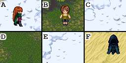
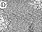
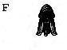

# captcha-splitter
## About
Convert captchas from this:

To this:
  
   
## Installation

- Install Rust

```
curl --proto '=https' --tlsv1.2 -sSf https://sh.rustup.rs | sh
```
- Clone repo
```
git clone https://github.com/Avemeno/captcha-splitter
cd captcha-splitter
cargo b --release
```
## Usage
Run it like this 
```
cargo r --release
```
Now you have splitted images in `./processed/` catalog
If you want to then move executable to different catalog.
```
mv target/release/captcha-splitter /my/new/catalog
```
and now use it directly
```
cd /my/new/catalog
./captcha-splitter --help
```
